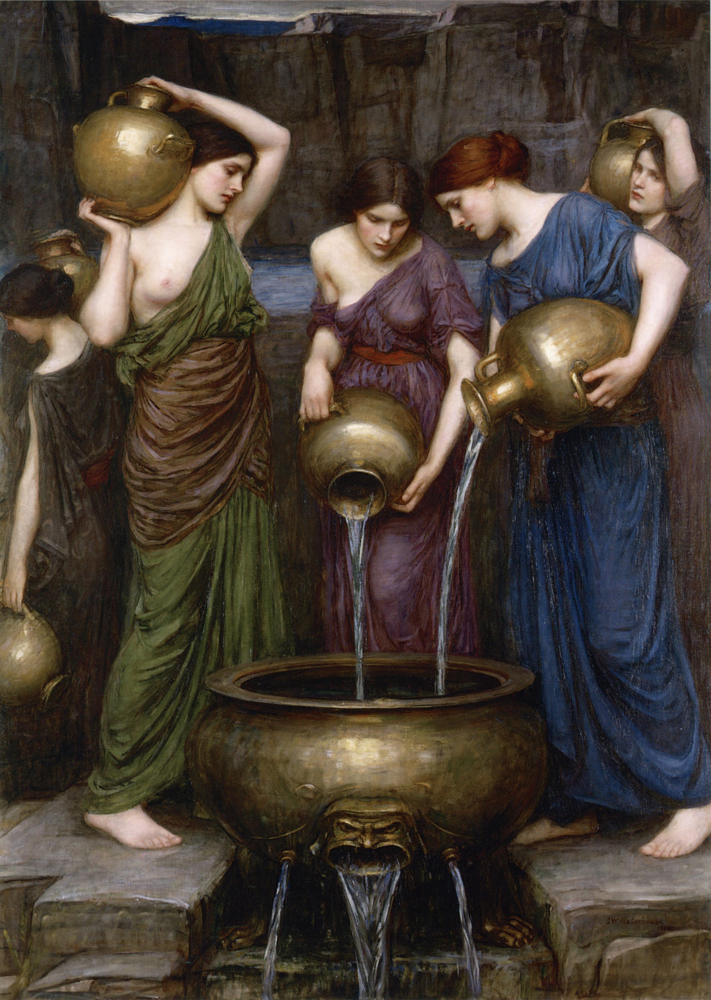

- Danaus的五十个女儿
- Danaus命令她们在婚礼前一天晚上杀死她们的丈夫（Danaus的双胞胎兄弟的五十个儿子）。其中49个女儿听从了父亲，杀死了丈夫。
- 她们的惩罚是在 [[Tartarus深渊之神塔尔塔罗斯]] 装满漏水的水缸。
	- 
		- [[拉斐尔前派]] [[John William Waterhouse]]
		- [[logicomix罗素的故事]]
	- [[Sisyphus西西弗斯]]
	- [[Ocnus奥克努斯]]