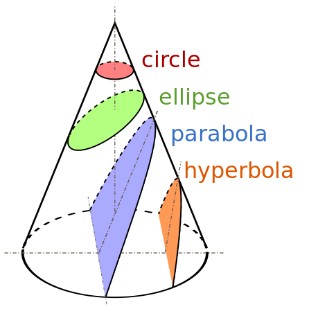

- 希腊语词根，elleipsis意为不足、缺乏。
- 日食——“失去”了太阳
- ellipsis
	- 省略号
	- ellipse椭圆（不足）
		- 因为截取圆锥的平面与底面夹角小于圆锥底角
	- 其他圆锥曲线
	- parabola
		- 抛物线
		- 截取圆锥的平面与底面夹角等于圆锥底角
		- parable 寓言
			- 并置，平行parallel
	- hyperbola
		- 双曲线
		- 截取圆锥的平面与底面夹角大于圆锥底角
		- hyperbole 夸张 exaggeration
- 