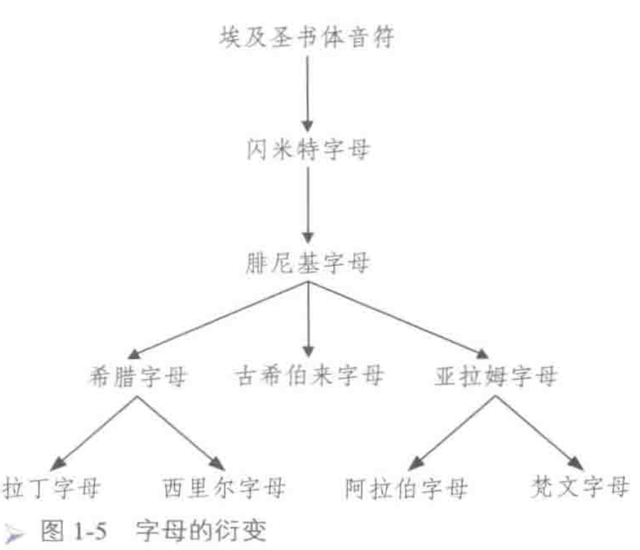

- 腓尼基（闪米特人的一支）发展22个腓尼基字母。
	- 没有元音字母。
	- 西里尔字母——斯拉夫语
	- 
- 希腊字母
	- 传说[[Cadmus卡德摩斯]]为希腊带来了腓尼基字母。
	- [[alphabet字母表]]
	- | 序号 | 大写 | 小写 | 英文 | 汉字注音 | 英语音标注音 |
	  | 1 | Α | α | alpha | 阿尔法 | /'ælfə/ |
	  | 2 | Β | β | beta | 贝塔 | /'bi:tə/ 或 /'beɪtə/ |
	  | 3 | Γ | γ | gamma | 格玛 | /'gæmə/ |
	  | 4 | Δ | δ | delta | 德尔塔 | /'deltə/ |
	  | 5 | Ε | ε | epsilon | 埃普西龙 | /'epsɪlɒn/ |
	  | 6 | Ζ | ζ | zeta | 泽塔 | /'zi:tə/ |
	  | 7 | Η | η | eta | 艾塔 | /'i:tə/ |
	  | 8 | Θ | θ | theta | 西塔 | /'θi:tə/ |
	  | 9 | Ι | ι | iota | 埃欧塔 | /aɪ'əʊtə/ |
	  | 10 | Κ | κ | kappa | 堪帕 | /'kæpə/ |
	  | 11 | ∧ | λ | lambda | 兰姆达 | /'læmdə/ |
	  | 12 | Μ | μ | mu | 谬 / 穆 | /mju:/ |
	  | 13 | Ν | ν | nu | 拗 / 奴 | /nju:/ |
	  | 14 | Ξ | ξ | xi | 克西 | /ˈzaɪ/ |
	  | 15 | Ο | ο | omicron | 欧米可戎 | /əuˈmaikrən / 或 /ˈɑmɪˌkrɑn/ |
	  | 16 | ∏ | π | pi | 派 | /paɪ/ |
	  | 17 | Ρ | ρ | rho | 若 | /rəʊ/ |
	  | 18 | ∑ | σ | sigma | 西格马 | /'sɪɡmə/ |
	  | 19 | Τ | τ | tau | 套 | /tɔ:/ 或 /taʊ/ |
	  | 20 | Υ | υ | upsilon | 宇普西龙 | /ˈipsɪlon / 或 /ˈʌpsɪlɒn/ |
	  | 21 | Φ | φ | phi | 弗爱 | /faɪ/ |
	  | 22 | Χ | χ | chi | 凯 / 柯义 | /kaɪ/ |
	  | 23 | Ψ | ψ | psi | 普赛 | /psaɪ/ |
	  | 24 | Ω | ω | omega | 欧米嘎 | /'əʊmɪɡə/ 或 /oʊ'meɡə/ |
	- 1-19由腓尼基字母改造而来
	- 20-24这五个字母是希腊人自己创造的
	- 元音
		- 由腓尼基字母化用来五个
			- α, ε, η, ι, ο
		- 希腊人创造两个
		-
-